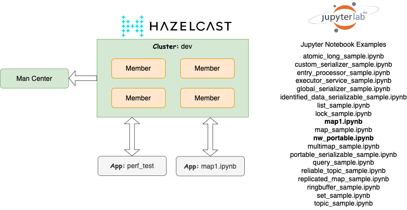

 [*PadoGrid*](https://github.com/padogrid) | [*Catalogs*](https://github.com/padogrid/catalog-bundles/blob/master/all-catalog.md) | [*Manual*](https://github.com/padogrid/padogrid/wiki) | [*FAQ*](https://github.com/padogrid/padogrid/wiki/faq) | [*Releases*](https://github.com/padogrid/padogrid/releases) | [*Templates*](https://github.com/padogrid/padogrid/wiki/Using-Bundle-Templates) | [*Pods*](https://github.com/padogrid/padogrid/wiki/Understanding-Padogrid-Pods) | [*Kubernetes*](https://github.com/padogrid/padogrid/wiki/Kubernetes) | [*Docker*](https://github.com/padogrid/padogrid/wiki/Docker) | [*Apps*](https://github.com/padogrid/padogrid/wiki/Apps) | [*Quick Start*](https://github.com/padogrid/padogrid/wiki/Quick-Start)

---
# Hazelcast JupyterLab Python Examples

This bundle provides Hazelcast Python client examples running on JupyterLab in PadoGrid. It demonstrates how PadoGrid workspaces are seamlessly integrated with JupyterLab workspaces.

## Installing Bundle

```bash
install_bundle -download -workspace bundle-hazelcast-examples-python
```

## Use Case

This bundle provides step-by-step instructions for creating a JupyterLab environment in PadoGrid and executing Hazelcast Python clients in Jupyter Notebook that writes and reads to/from a local Hazelcast cluster.



## Installing JupyterLab

Install JupyterLab on your machine as described in the following section in the PadoGrid manual.

[JupyterLab](https://github.com/padogrid/padogrid/wiki/JupyterLab)

## Startup Sequence

1. Start JupyterLab

```bash
open_jupyter
```

2. Switch workspace in each terminal

Due to JupyterLab limitations, the terminals shown in the browser are not in the PadoGrid workspace context. Execute the following in each terminal to switch to the PadoGrid workspace. Make sure to replace `<your_rwe>` with your RWE name.

```bash
switch_rwe <your_rwe>/bundle-hazelcast-example-python
```

3. Start cluster

From one of the terminals in the browser, create and start a Hazelcast cluster.

```bash
make_cluster -product hazelcast
start_cluster -all
```

4. Install Hazelcast Python client package

```bash
pip install hazelcast-python-client
```

5. Open and run `apps/python_examples/map1.ipynb`. The following shows `map1.ipynb` contents.

```python
import hazelcast

# Start the Hazelcast Client and connect to an already running Hazelcast Cluster on 127.0.0.1
client = hazelcast.HazelcastClient()

# Get a map from Cluster.
map1 = client.get_map("map1").blocking()

# PUt values
map1.put("key1", "value1")
map1.put("key2", "value2")

# Get values
value1=map1.get("key1")
value2=map1.get("key2")

# Print map values
print('value1=' + value1)
print('value2=' + value2)

# Concurrent Map methods, optimistic updating
map1.put_if_absent("key3", "value3")
map1.replace_if_same("key1", "value1", "new_value1")

# Get values
value1=map1.get("key1")
value2=map1.get("key2")
value3=map1.get("key3")

# Print map values
print()
print('value1=' + value1)
print('value2=' + value2)
print('value3=' + value3)

# Shutdown this Hazelcast Client
client.shutdown()
```

6. Open and run `nw_portable.ipynb`. This notebook puts and gets Customer and `Order` objects into/from the `nw/customers` and `nw/orders` maps, respectively. After you ran the notebook, you can check the entries by running the `perf_test` app from the terminal as follows.

```bash
create_app
cd_app perf_test/bin_sh
./read_cache nw/customers
./read_cache nw/orders
```

You can also ingest mock data into the `nw/customers` and `nw_orders` maps using `perf_test` as follows.

```bash
cd_app perf_test/bin_sh
# First, build perf_test to download the necessary jar files
./buid_app
# Ingest Customer and Order objects into nw/customer and nw/orders, respectively
./test_group -run -prop ../etc/group-factory.properties
```

Upon completion, run `read_cache` as described above and use `customerId` and `orderId` in your Python code to retrieve `Customer` and `Order` objects.

7. Open other example Notebook files and run them. They are extracted from [1].

8. Open Management Center in the browser and check the **map1** entries.

URL: http://localhost:8080/hazelcast-mancenter

## Teardown

```bash
stop_cluster -all
stop_jupyter
```

## References

1. Hazelcast Python Client Examples, https://github.com/hazelcast/hazelcast-python-client/tree/master/examples/org-website

---

 [*PadoGrid*](https://github.com/padogrid) | [*Catalogs*](https://github.com/padogrid/catalog-bundles/blob/master/all-catalog.md) | [*Manual*](https://github.com/padogrid/padogrid/wiki) | [*FAQ*](https://github.com/padogrid/padogrid/wiki/faq) | [*Releases*](https://github.com/padogrid/padogrid/releases) | [*Templates*](https://github.com/padogrid/padogrid/wiki/Using-Bundle-Templates) | [*Pods*](https://github.com/padogrid/padogrid/wiki/Understanding-Padogrid-Pods) | [*Kubernetes*](https://github.com/padogrid/padogrid/wiki/Kubernetes) | [*Docker*](https://github.com/padogrid/padogrid/wiki/Docker) | [*Apps*](https://github.com/padogrid/padogrid/wiki/Apps) | [*Quick Start*](https://github.com/padogrid/padogrid/wiki/Quick-Start)
